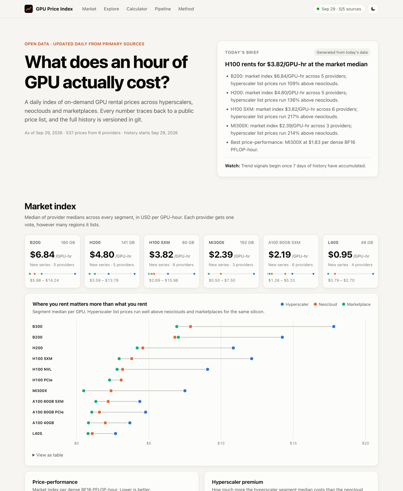
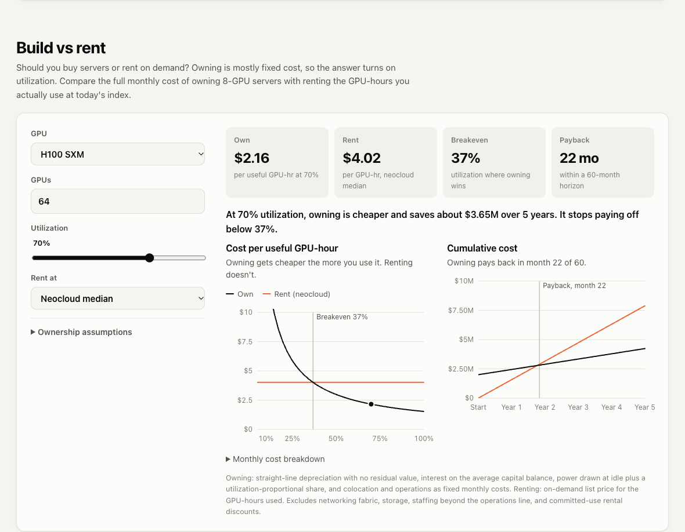
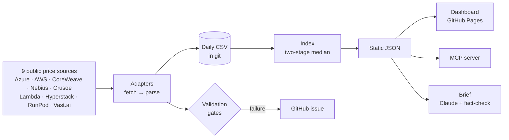

# GPU Price Index

**An open, daily index of GPU rental prices across hyperscalers, neoclouds and
marketplaces, built from primary sources and versioned in git.**

[](https://github.com/ewyluda/gpu-price-index/actions/workflows/ci.yml)
[](https://github.com/ewyluda/gpu-price-index/actions/workflows/collect.yml)
[](LICENSE)

**[Live dashboard →](https://ewyluda.github.io/gpu-price-index/)** ·
[Case study](docs/case-study.md) · [Methodology](docs/methodology.md) · [Architecture](docs/architecture.md)

<picture>
  <source media="(prefers-color-scheme: dark)" srcset="docs/img/dashboard-dark.png">
  
</picture>

## Why

If you plan or buy AI compute, the first question is always *what should this cost?* The
answer depends less on which GPU you pick than on **where you rent it**. On day one of the
index, an H100 SXM listed at a **$3.82/GPU-hr** market median. The hyperscaler segment
median was **$12.12**, and marketplace offers started at **$2.69**. That's a 4.5× spread for
the same silicon.

This project turns that price surface into something you can plan with:

- **A daily index** for 11 data-center GPUs (B300, B200, H200, H100 SXM/NVL/PCIe, MI300X,
  A100 variants, L40S), split into hyperscaler, neocloud and marketplace segments.
- **A cluster cost calculator:** *512 H100s for 90 days* quoted per provider.
- **Build vs rent:** the full cost of owning 8-GPU servers (depreciation, capital, power,
  colocation, operations) against renting at the index, with the breakeven utilization
  and payback month. Every assumption is editable.
- **Price-performance:** $/PFLOP-hour and $/GB-hour, so a B200 and an A100 can be compared on
  what you actually buy.
- **An MCP server**, so Claude (or any agent) can answer budget questions from live data.
- **A fact-checked daily brief:** Claude writes the prose, and code verifies every number.

<picture>
  <source media="(prefers-color-scheme: dark)" srcset="docs/img/build-vs-rent-dark.png">
  
</picture>

## How it works



Every morning at 06:17 UTC, a GitHub Actions job does the following:

1. Pulls ~570 prices from nine sources (ten providers) in about 11 seconds, over plain HTTP.
2. Normalizes each price to USD per GPU-hour.
3. Validates the data: schema, price bounds, per-source volume, and day-over-day drift.
4. Commits the day's CSV to the repo and redeploys the dashboard.

If a source breaks, the other sources still publish, the job opens an issue, and the next
healthy run closes it.

The **index** is a two-stage median: each provider's median across its SKUs and regions, then
the median across providers. Azure's hundreds of regional rows get the same single vote as
Lambda's one price list. See [methodology](docs/methodology.md) for the full definitions,
normalization rules and limitations.

## Quickstart

Requires [uv](https://docs.astral.sh/uv/).

```bash
uv sync --all-extras
uv run gpu-index run      # collect all sources, validate, build site data, write the brief
uv run gpu-index show     # print today's index
python3 -m http.server 8765 --directory site   # dashboard at http://localhost:8765
```

```text
GPU                Index   Hyper     Neo  Market  Premium  $/PF-hr
B200                6.84   14.24    6.81    7.05    +109%     3.04
H200                4.80   10.85    4.59    4.20    +136%     4.85
H100 SXM            3.82   12.12    3.82    2.95    +217%     3.86
MI300X              2.39    7.50    2.39    0.50    +214%     1.83
...
```

### Ask an agent (MCP)

```bash
# from a checkout
claude mcp add gpu-index -- uv run --directory "$PWD" gpu-index-mcp
# or straight from GitHub (reads the published dashboard data)
claude mcp add gpu-index -- uvx --from "gpu-index[mcp] @ git+https://github.com/ewyluda/gpu-price-index" gpu-index-mcp
```

Tools: `list_gpus`, `get_prices`, `get_history`, `estimate_cluster_cost`, `build_vs_rent`,
`compare_price_performance`, `pipeline_status`. For example: *"What would 512 H100s for 90
days cost at neoclouds vs hyperscalers, and which GPU is cheapest per PFLOP?"*

### Development

```bash
uv run pytest          # no network: parsers run against recorded fixtures
node --test tests/tco.test.mjs   # build-vs-rent JS matches the Python reference
uv run ruff check . && uv run ruff format --check .
uv run mypy            # strict
```

## Engineering notes

- **Primary sources only.** Every number traces to a provider's own public price list.
  [Each adapter](src/gpu_index/sources/) records why its data may be used.
- **Parsers are pure and fixture-tested.** `fetch` does I/O; `parse` is a pure function
  tested against recorded payloads. An upstream format change fails a volume gate instead of
  silently publishing empty data.
- **Data as code.** Daily CSVs in git make every price change reviewable with
  `git log -p data/observations`.
- **The LLM never introduces numbers.** Every figure in Claude's draft brief must match the
  day's fact sheet for the GPU it's attributed to, including the sign on percentages. After
  one retry with feedback, the brief falls back to a deterministic template
  ([`brief.py`](src/gpu_index/brief.py)).
- **Outages don't masquerade as price moves.** Sources are validated before storage, and a
  missing provider's last prices are carried forward (flagged) for up to 3 days.
- **No build step on the front end.** One HTML file, one stylesheet, one dependency-free
  module drawing SVG charts, with light/dark themes, keyboard-accessible tooltips and a table
  view for every chart.

More in [docs/architecture.md](docs/architecture.md), including how to add a source.

## How this was built

I built this by directing AI coding agents (Claude Code), run the way I'd run a delivery
program: set the scope, make or approve every decision, review the work, and hold each
phase to acceptance criteria before it merges.

**Direction and decisions (mine):**
- The problem and the audience: people planning and buying compute who need to know what
  an hour of GPU *should* cost, and how much depends on where they rent it.
- Sourcing ethics: retiring the original third-party index once its terms ruled out
  storage and redistribution, and admitting a new source only after a robots.txt and terms
  check. Two candidates failed that check and are excluded.
- Methodology: one vote per provider, carrying outages forward instead of letting them
  read as price drops, matched-provider changes when coverage changes, and a minimum
  listing count for marketplace prices.
- Scope, sequencing and every merge.

**Implementation (agents):** the audit of the v0 scraper, the code, tests and docs, and a
separate review pass. An independent reviewing agent found seven correctness issues before
launch, including source outages that would have shown up as 27–39% price moves. All seven
were fixed with regression tests before merge.

**Guardrails:** every change goes through tests (recorded fixtures, strict typing, a
JavaScript/Python parity check), CI and a pull request. Agent-written commits carry a
`Co-Authored-By` trailer, so the history shows who wrote what.

## Project history

v0 was a Selenium scraper for one third-party GPU index. An audit found three problems. It
had never stored a rate: the parser targeted auto-generated element IDs. The data it was
built to collect sat in the plain HTTP response the whole time. And the publisher's terms
prohibit storing or redistributing their data. v1 is a ground-up rebuild on primary sources.
Collection went from a 100-second headless-browser run that yielded 0 rows to an 8-second
HTTP run that yields ~570 rows across 10 providers. The prototype remains in git history.

## Roadmap

- Google Cloud (Cloud Billing Catalog API) and Oracle Cloud, to round out the hyperscaler segment
- Reserved/committed pricing where providers publish it
- Weekly email/Slack digest of index moves

## License

Code is [MIT](LICENSE). Prices are derived from each provider's public price lists and
remain their publishers' information. They're shown for reference, not as procurement
advice.
