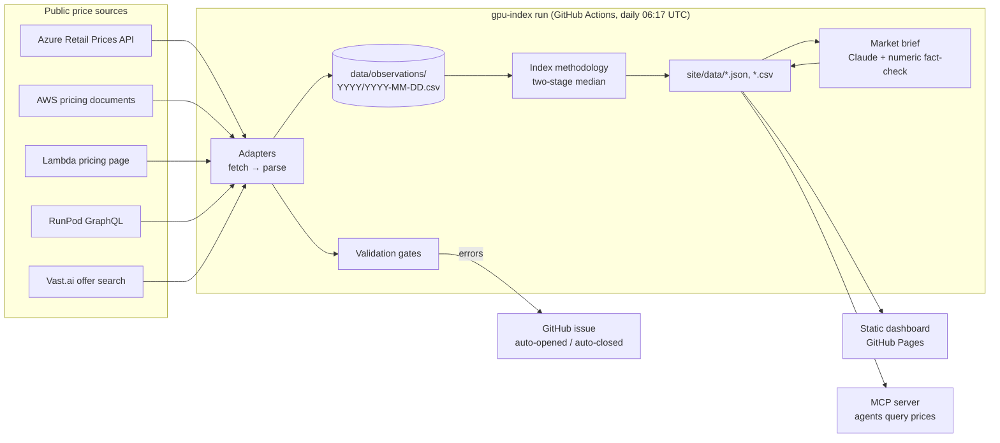

# Architecture

## Modules

| Module | Responsibility |
|---|---|
| `sources/*.py` | One adapter per source. `fetch(client)` does I/O and returns the raw payload. `parse(payload, stamp)` is pure and returns `Observation`s |
| `catalog.py` | Canonical GPU keys, specs, and name → key / region → geography normalization |
| `models.py` | `Observation`, the one record type everything shares |
| `pipeline.py` | Runs every adapter with failure isolation, persists, validates |
| `store.py` | CSV-per-day storage. Idempotent same-day re-runs |
| `validate.py` | Schema, bounds, volume and drift checks |
| `index.py` | The methodology: provider medians → segment and market indices, changes, premium, regional, price-performance, cost estimates |
| `tco.py` | Build vs rent: ownership cost model, breakeven utilization, payback (JS twin in `site/tco.js`, kept in sync by a shared fixture) |
| `publish.py` | Writes the dashboard's JSON/CSV artifacts and the run log |
| `brief.py` | Daily market brief: deterministic template, optional Claude rewrite behind a fact-check |
| `mcp_server.py` | Exposes the published artifacts to agents as MCP tools |
| `cli.py` | `gpu-index collect / build / brief / run / show` |

## Design decisions

**Primary sources over a third-party index.** The prototype scraped a single proprietary
benchmark whose terms don't permit storing or redistributing its data. That's a
non-starter for a public dataset, and a derivative of someone else's index doesn't answer
"what would *we* pay, and where?" Rebuilding on providers' own price lists makes every number
traceable to its publisher.

**Plain HTTP, no browser.** The prototype drove headless Chrome for ~100 s per run, with
anti-bot-detection code, and still stored no rates. Every current source is a JSON API or a
server-rendered table. The full five-source collection takes about 8 seconds, runs on a stock
GitHub runner, and identifies itself with an honest User-Agent.

**`fetch` / `parse` split, fixture-tested.** Parsers are pure functions tested against
recorded payloads in `tests/fixtures/`, so CI never touches the network. An upstream format
change shows up either as a fixture diff when fixtures are refreshed, or as a volume-gate
failure in the daily run. It can't silently produce empty data.

**Data as code.** Daily CSVs committed to git give a free, public, diffable audit trail:
`git log -p data/observations` shows exactly when and how a price changed. At ~75 KB/day
this stays small for years. The analytical load is a few thousand rows, far below anything
that needs a database.

**Failure isolation over all-or-nothing.** One broken source must not blank the index or
distort it. Each adapter runs in its own try/except, and each source is validated before
anything is written. A failed or implausible source is rejected, its earlier same-day rows
are preserved, and its last prices are carried forward (flagged) for up to 3 days, so an
outage can't show up as a price move. The run is marked failed and opens an issue.

**Two-stage median.** Covered in [methodology.md](methodology.md#two-stage-median). It's the
single most important modeling choice: it stops the provider with the most regions from
defining "the market".

**Static site, no build step.** The dashboard is one HTML file, one stylesheet and one
dependency-free ES module rendering SVG by hand. It deploys anywhere, loads fast, and has
nothing to keep patched.

**The LLM writes prose, never numbers.** The brief is generated from a pre-rounded fact
sheet. Every number in Claude's draft is checked against the facts for the GPU its sentence
names: dollar figures, signed percentages (so "fell 12%" can't stand in for "+12%"),
multiples, and bare numbers. One retry with feedback is allowed, then it falls back to a
deterministic template. The model adds readability, but it can't introduce a figure that
isn't in the data.

**MCP as the agent interface.** Budget questions ("what would 512 H100s for a quarter cost at
neoclouds?") are what people actually ask. Exposing the index as MCP tools lets any agent
answer them from live data with the same cost logic as the dashboard.

## Adding a source

1. Create `src/gpu_index/sources/<name>.py` with `fetch`, `parse` and an `ADAPTER`
   (`SourceAdapter`), including a `terms` note on why the data may be used.
2. Map the provider's GPU labels through `catalog.normalize_gpu_name`, and add catalog
   entries if needed.
3. Register the adapter in `sources/__init__.py`.
4. Record a trimmed payload in `tests/fixtures/` and add parser tests in `tests/test_sources.py`.
5. Run `uv run gpu-index collect --source <name>` and check `uv run gpu-index show`.
6. Add the source to the table in `docs/methodology.md`.

## Operations

| Workflow | Trigger | Does |
|---|---|---|
| `ci.yml` | push to main, PRs | ruff, ruff format, mypy (strict), pytest on Python 3.11 and 3.13, JS/JSON sanity |
| `collect.yml` | daily 06:17 UTC, manual | collect → validate → build → brief → commit → deploy. Opens/closes the `pipeline-failure` issue |
| `pages.yml` | pushes touching `site/`, called by `collect.yml` | deploy `site/` to GitHub Pages |

Secrets: `ANTHROPIC_API_KEY` (optional; without it the brief uses the template).
